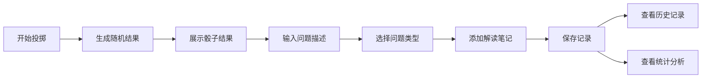

## 1. 产品概述

占星骰子记录与分析工具，为占星骰子爱好者提供骰子结果生成、记录保存以及长期数据统计分析功能。通过按问题类型分类记录，帮助用户发现行星、星座、宫位组合的出现规律，提升占卜实践的深度和准确性。

## 2. 核心功能

### 2.1 用户角色

| 角色 | 注册方式 | 核心权限 |
|------|----------|----------|
| 普通用户 | 无需注册，本地存储 | 生成骰子、记录结果、查看统计分析 |

### 2.2 功能模块

1. **首页/投掷页**：骰子生成动画、结果展示、快速记录
2. **记录管理页**：历史记录列表、按问题类型筛选、删除记录
3. **统计分析页**：行星/星座/宫位频率统计、组合分析、可视化图表
4. **问题类型管理**：自定义问题分类标签

### 2.3 页面详情

| 页面名称 | 模块名称 | 功能描述 |
|----------|----------|----------|
| 投掷页 | 骰子生成区 | 点击按钮随机生成行星、星座、宫位组合，带动画效果 |
| 投掷页 | 记录表单 | 输入问题描述、选择问题类型、添加解读笔记、保存记录 |
| 记录管理页 | 记录列表 | 展示所有历史记录，支持按时间、类型筛选搜索 |
| 记录管理页 | 类型筛选 | 按问题类型（爱情、事业、财运等）过滤记录 |
| 统计分析页 | 频率统计 | 展示各行星、星座、宫位的出现频率排行 |
| 统计分析页 | 组合分析 | 展示最常见的二元、三元组合及其出现次数 |
| 统计分析页 | 类型分布 | 按问题类型分类展示各维度的分布情况 |
| 统计分析页 | 数据可视化 | 柱状图、饼图展示统计结果 |

## 3. 核心流程

用户点击投掷按钮 → 系统随机生成行星、星座、宫位组合 → 展示结果并播放动画 → 用户输入问题和笔记 → 选择问题类型 → 保存记录 → 可在统计页查看长期数据分析。

## 4. 用户界面设计

### 4.1 设计风格

- **主色调**：深靛蓝 (#1e1b4b) 作为主色，营造神秘星空氛围
- **辅助色**：紫罗兰 (#7c3aed)、金色 (#fbbf24) 作为点缀，象征宇宙与智慧
- **背景**：深邃星空渐变背景，点缀微弱星光效果
- **按钮风格**：圆润立体按钮，悬停时有发光效果
- **字体**：标题使用衬线字体增强古典感，正文使用清晰易读的无衬线字体
- **布局风格**：卡片式布局，层次分明，略带玻璃拟态效果
- **图标**：使用星星、月亮、星座等符号元素

### 4.2 页面设计概述

| 页面名称 | 模块名称 | UI元素 |
|----------|----------|--------|
| 投掷页 | 骰子展示区 | 三张圆形卡片分别展示行星、星座、宫位，带旋转动画 |
| 投掷页 | 记录表单 | 下拉选择器、文本输入框、标签选择器 |
| 记录管理页 | 记录卡片 | 时间戳、问题类型标签、结果摘要、展开详情按钮 |
| 统计分析页 | 统计图表 | 柱状图展示频率排行，饼图展示分布比例 |
| 统计分析页 | 组合排行 | 列表展示热门组合，按出现次数排序 |

### 4.3 响应式

- 桌面端优先设计，三栏布局展示
- 移动端自适应为单列布局，优化触控区域
- 统计图表在小屏幕上简化展示

## 5. 数据结构

占星骰子包含三个维度：
- **行星**：太阳、月亮、水星、金星、火星、木星、土星、天王星、海王星、冥王星、北交点、南交点（共12个）
- **星座**：白羊座、金牛座、双子座、巨蟹座、狮子座、处女座、天秤座、天蝎座、射手座、摩羯座、水瓶座、双鱼座（共12个）
- **宫位**：1宫、2宫、3宫、4宫、5宫、6宫、7宫、8宫、9宫、10宫、11宫、12宫（共12个）
