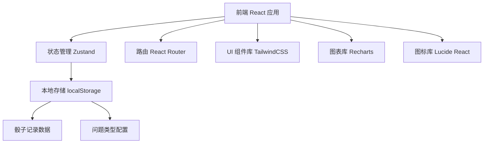
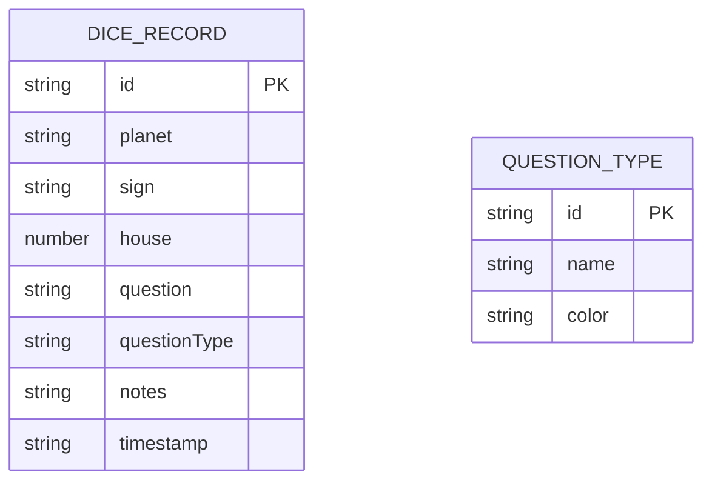

## 1. 架构设计



## 2. 技术描述

- **前端框架**: React@18 + TypeScript
- **构建工具**: Vite
- **状态管理**: Zustand
- **路由**: React Router DOM
- **样式**: TailwindCSS@3
- **图表**: Recharts
- **图标**: Lucide React
- **数据存储**: localStorage（纯前端本地存储）
- **初始化工具**: vite-init
- **后端**: 无（纯前端应用）

## 3. 路由定义

| 路由 | 页面 | 用途 |
|------|------|------|
| / | 投掷页 | 生成骰子结果、记录新投掷 |
| /records | 记录管理页 | 查看历史记录、筛选搜索、删除记录 |
| /analytics | 统计分析页 | 频率统计、组合分析、可视化图表 |

## 4. 数据模型

### 4.1 数据模型定义



### 4.2 数据实体定义

```typescript
interface Planet {
  name: string;
  symbol: string;
}

interface Sign {
  name: string;
  symbol: string;
  element: string;
  modality: string;
}

interface House {
  number: number;
  name: string;
}

interface DiceResult {
  planet: Planet;
  sign: Sign;
  house: House;
}

interface DiceRecord {
  id: string;
  planet: string;
  sign: string;
  house: number;
  question: string;
  questionType: string;
  notes: string;
  timestamp: string;
}

interface QuestionType {
  id: string;
  name: string;
  color: string;
}

interface FrequencyStats {
  planet: Record<string, number>;
  sign: Record<string, number>;
  house: Record<string, number>;
}

interface CombinationStats {
  planetSign: Record<string, { count: number; planet: string; sign: string }>;
  planetHouse: Record<string, { count: number; planet: string; house: number }>;
  signHouse: Record<string, { count: number; sign: string; house: number }>;
  triple: Record<string, { count: number; planet: string; sign: string; house: number }>;
}
```

## 5. 项目结构

```
src/
├── components/
│   ├── DiceDisplay.tsx      # 骰子结果展示组件
│   ├── DiceForm.tsx         # 记录表单组件
│   ├── RecordCard.tsx       # 记录卡片组件
│   ├── StatsChart.tsx       # 统计图表组件
│   ├── Navbar.tsx           # 导航栏组件
│   ├── TypeTag.tsx          # 问题类型标签
│   └── StarBackground.tsx   # 星空背景组件
├── pages/
│   ├── RollPage.tsx         # 投掷页
│   ├── RecordsPage.tsx      # 记录管理页
│   └── AnalyticsPage.tsx    # 统计分析页
├── store/
│   └── useDiceStore.ts      # Zustand 状态管理
├── utils/
│   ├── diceData.ts          # 行星/星座/宫位数据
│   ├── statistics.ts        # 统计计算工具
│   └── storage.ts           # 本地存储工具
├── types/
│   └── index.ts             # 类型定义
├── App.tsx
├── main.tsx
└── index.css
```

## 6. 核心功能实现要点

1. **骰子生成**: 使用 `Math.random()` 从三个维度的数组中随机选择
2. **动画效果**: 使用 CSS transforms 和 transitions 实现骰子旋转动画
3. **数据持久化**: 通过 Zustand 中间件持久化到 localStorage
4. **统计计算**: 遍历记录数组，使用对象/Map 统计频率
5. **图表可视化**: 使用 Recharts 渲染柱状图和饼图
6. **筛选功能**: 根据问题类型、时间范围过滤记录
